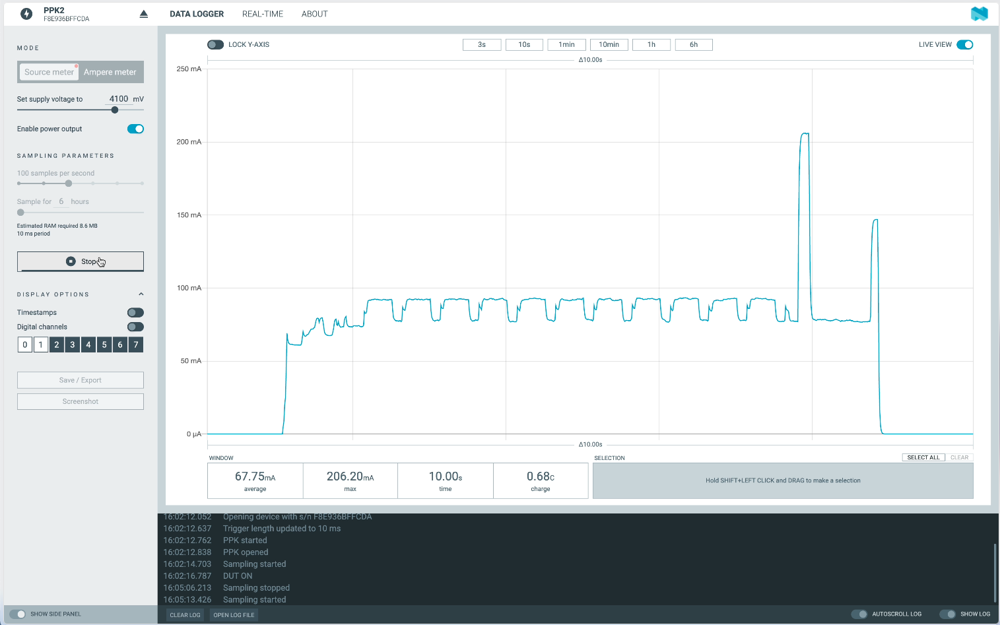

# LORA-GPS-Tracker

**This page is a work in progress!**

</a>

This LORA-GPS-Tracker was designed to just test three modules, which I haven't worked with yet: the RFM95 LORA module, the ESP32-S2-Mini module and the ATGM336h GPS module. All combined this device can be used as a GPS-Tracker for LORA based systems. Additionally to the modules, the board includes a 0.96" OLED display, two user buttons, a user RGB LED, a LiPo battery charger with a 16340 cell holder, and a dual LDO setup, which is very handy when it comes to deep sleeping.

Here are some specs of the board:
- ESP32-S2-Mini
- USB Type-C for charging the battery and flashing the ESP32
- Dual LDO setup, which will reduce the sleep current (the main power sinks can be shut down before entering a sleep mode)
- Power friendly OLED display
- Dimensions are 60x43mm

The [Youtube Video](https://youtu.be/C7jFupvuy9M) shows the PCB assembly process, some initial tests and some power measurements.

## Connections

The RFM95 LORA module is connected via SPI, the ATGM336h GPS module is connected via UART and the OLED display is connected via I2C.

GPIO ESP32 | Function | Mode
-------- | -------- | --------
GPIO1 | LORA_RST | Output
GPIO2 | LORA_MISO | Input
GPIO3 | LORA_MOSI | Output
GPIO4 | LORA_SCK | Output
GPIO5 | LORA_CS | Output
GPIO6 | LORA_INT | Input
GPIO7 | LORA_DIO1 | Data
GPIO8 | LORA_DIO2 | Data
GPIO12 | Button2 | Input
GPIO14 | Enable LDO2 | Output
GPIO15 | BAT_ADC | Input
GPIO16 | Button1 | Input
GPIO19 | USB_DN | Data
GPIO20 | USB_DP | Data
GPIO34 | OLED_RST | Output
GPIO35 | I2C_SCL | Output
GPIO36 | I2C_SDA | Data
GPIO37 | LED_CLK | Output
GPIO38 | LED_SDI | Data
GPIO40 | GPS_PPS | Input
GPIO41 | GPS_RXD | Input
GPIO42 | GPS_TXD | Output

By switching off the EN_LDO2 output, the second LDO which powers the GPS as well as LORA module, the on board LED and the OLED display, will be shut down.

## Power measurements

</a>

State | Avg. current | Peak current
-------- | -------- | --------
Reading sensors | 80mA | 92mA
Transmitting LORA | 135mA | 208mA
Deep sleep | 75µA | 82µA
